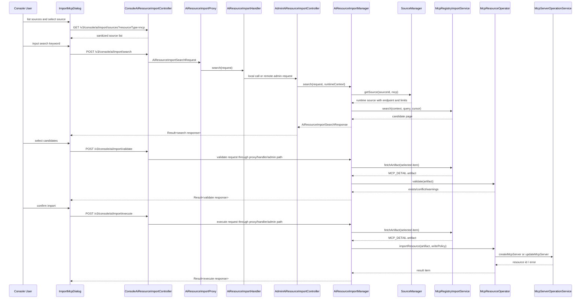

<!--
  Copyright 1999-2026 Alibaba Group Holding Ltd.

  Licensed under the Apache License, Version 2.0 (the "License");
  you may not use this file except in compliance with the License.
  You may obtain a copy of the License at

       http://www.apache.org/licenses/LICENSE-2.0

  Unless required by applicable law or agreed to in writing, software
  distributed under the License is distributed on an "AS IS" BASIS,
  WITHOUT WARRANTIES OR CONDITIONS OF ANY KIND, either express or implied.
  See the License for the specific language governing permissions and
  limitations under the License.
-->

# Issue 15183 AI 资源导入落地开发计划

Issue: https://github.com/alibaba/nacos/issues/15183

## 1. 目标与交付边界

本计划用于把 `ai-resource-import` 从 spec 概念落到可开发、可评审、可分阶段合入的工程任务。

第一阶段交付目标：

- 提供统一的 AI 资源导入框架，支持按 `sourceId` 从运维配置的来源导入资源。
- 支持 MCP registry 导入迁移到统一框架。
- 支持 Skill 外部来源导入的框架和最小可用 importer。
- 保留旧 MCP 导入 API 的兼容路径，但禁止默认使用用户传入 URL 作为服务端访问目标。
- 使导入插件不依赖 MCP 当前 Config 存储，也不依赖 Skill 存储实现细节。

非目标：

- 不在本任务内完成 MCP `ai_resource` 化迁移。
- 不把 `ai-registry-adaptor` 改造成写入或导入面。
- 不实现任意第三方 Skill 市场的全部高级能力。
- 不默认递归导入 Skill 依赖的 MCP 资源。
- 不在第一阶段实现所有第三方市场的定制 UI，但 MCP 导入迁移必须包含 Console 可用入口；
  Skill UI 可先复用统一导入弹窗的最小能力。

## 2. 总体落地策略

实现按四层推进：

```text
Import API
  -> Import Manager
     -> Import Plugin
     -> Resource Operator
        -> Current Resource Service
```

各层职责：

| 层级 | 职责 | 不负责 |
|------|------|--------|
| API | 参数校验、鉴权、响应包装、兼容路由 | 外部协议转换、资源写入细节 |
| Import Manager | source 路由、search/validate/execute 编排、依赖策略、审计 | 具体外部协议、具体资源存储 |
| Import Plugin | 外部来源查询、分页、拉取 artifact、外部模型转换 | Nacos 写入、权限、生命周期 |
| Resource Operator | 资源类型校验、冲突处理、调用领域服务写入 | 外部来源协议 |
| Resource Service | 当前资源的真实创建、更新、存储、索引、事件 | 外部导入来源 |

MCP 当前没有完成 `ai_resource` 化，因此 `McpResourceOperator` 只面向
`McpServerOperationService` 等领域服务。未来 MCP 存储迁移时，只替换 Operator 内部实现。

## 3. 建议 PR 拆分

### PR 1: Spec 与开发计划

内容：

- 新增 `ai-resource-import` 插件 spec。
- 更新 AI Registry、MCP、Skill、Plugin spec 的导入边界。
- 新增本落地开发计划。

验收：

- `apache-rat:check` 通过。
- 文档能解释旧 MCP 导入 API 如何迁移到统一导入框架。

### PR 2: SPI 与基础模型

内容：

- 在 `api` 或 `plugin/ai` 中增加插件类型和导入 SPI。
- 增加 importer 共享模型。
- 增加 source 配置模型的基础类。
- 增加基础单元测试。

建议先只提供模型和加载框架，不接具体 MCP/Skill 业务。Importer SPI 放在 `plugin/ai`，
允许用户自定义导入来源；Operator 第一阶段放在 `ai` 模块内置，避免插件绕过 Nacos 资源生命周期。

### PR 3: Source Manager 与 Import Manager

内容：

- 实现 source 配置读取、校验、脱敏输出。
- 实现统一 search/validate/execute 编排。
- 增加 operator registry。
- 暴露 Admin/Console 的统一导入 API。
- 增加 Console proxy/handler 抽象，保证本地 Console 与 remote Console 的调用路径一致。

建议先接一个测试用 fake importer 和 fake operator，保证框架行为独立可测。

### PR 4: MCP registry 导入迁移

内容：

- 把当前 `McpExternalDataAdaptor` 的 registry URL/seed/json 解析能力迁移为 importer。
- 增加 `McpResourceOperator`，内部复用当前 MCP service。
- 旧 MCP `/import/validate` 和 `/import/execute` 路由到统一 manager。
- 默认禁止旧 `importType=url` 的任意 URL 访问。
- 改造现有 `ImportMcpDialog`，URL 输入改为 source 选择 + 搜索 + 选择 + 校验 + 导入。

### PR 5: Skill 导入最小能力

内容：

- 增加一个 Skill well-known/registry importer。
- 增加 `SkillResourceOperator`，内部复用 `SkillOperationService.uploadSkillFromZip`。
- search 阶段展示 Skill 元数据，validate 阶段展示冲突状态和 MCP 依赖 warning。
- Skill 管理页面增加导入入口，复用统一导入弹窗，第一阶段只开启 source 导入。

### PR 6: 安全加固与远程 Console

内容：

- 统一 HTTP source 安全 guard。
- DNS、redirect、私网地址、响应大小、页数、超时限制。
- maintainer-client 或 remote handler 接入统一 import API。
- 完善负向安全测试。

### PR 7: Console UI 增强与文档

内容：

- Console 批量选择、详情抽屉、结果过滤、失败重试、空状态和错误态优化。
- 用户文档和迁移说明。

如果 UI 工作量较大，可以继续拆成 MCP UI 与 Skill UI 两个 PR。

## 4. 代码模块与建议包名

### 4.1 `api` 模块

如需要暴露给 maintainer-client，公共请求响应模型建议放在：

```text
api/src/main/java/com/alibaba/nacos/api/ai/model/importer/
```

建议类：

| 类名 | 用途 |
|------|------|
| `AiResourceImportSourceInfo` | API 返回的脱敏 source 信息。 |
| `AiResourceImportSearchRequest` | search 请求。 |
| `AiResourceImportValidateRequest` | validate 请求。 |
| `AiResourceImportExecuteRequest` | execute 请求。 |
| `AiResourceImportSearchResponse` | search 聚合响应。 |
| `AiResourceImportValidateResponse` | validate 聚合响应。 |
| `AiResourceImportExecuteResponse` | execute 聚合响应。 |
| `AiResourceImportItem` | 选中的外部资源项。 |
| `AiResourceImportCandidateItem` | search 单项候选摘要。 |
| `AiResourceImportValidationItem` | validate 单项结果。 |
| `AiResourceImportResultItem` | execute 单项结果。 |
| `AiResourceImportDependency` | 资源依赖描述。 |
| `AiResourceImportDependencyPolicy` | 依赖策略枚举。 |

如果第一阶段只做服务端内部 API，模型可先放在 `ai` 模块，等 maintainer-client 接入时再下沉到
`api`。但为了 remote Console，建议一开始就把稳定请求响应模型放入 `api`。

### 4.2 `plugin/ai` 模块

插件 SPI 建议放在：

```text
plugin/ai/src/main/java/com/alibaba/nacos/plugin/ai/importer/
```

建议类：

```text
model/AiResourceImportContext
model/AiResourceImportCandidate
model/AiResourceImportCandidatePage
model/AiResourceImportValidation
model/AiResourceImportArtifact
model/AiResourceImportPayloadKind
model/AiResourceImportSource
model/AiResourceImportSourceSecretRef
spi/AiResourceImportService
spi/AiResourceImportServiceBuilder
```

注意：

- SPI 模型不要 import MCP/Skill 的具体 API 类。
- `payload` 可以先设计为 `byte[] payload` + `String payloadJson` 二选一。
- `source` 里不要放明文 secret，只放引用和已解析但不可输出的运行时配置。

### 4.3 `ai` 模块

建议包结构：

```text
ai/src/main/java/com/alibaba/nacos/ai/importer/
  config/
  controller/
  form/
  manager/
  operator/
  security/
  trace/
  compat/
  builtin/
```

建议类：

| 包 | 类名 | 职责 |
|----|------|------|
| `config` | `AiResourceImportProperties` | 读取 `nacos.ai.resource.import.*` 配置。 |
| `config` | `AiResourceImportSourceConfig` | 单个 source 内部配置。 |
| `manager` | `AiResourceImportSourceManager` | source 查询、校验、脱敏。 |
| `manager` | `AiResourceImportManager` | search/validate/execute 统一入口。 |
| `manager` | `AiResourceImportPluginManager` | SPI 加载和 importer 路由。 |
| `operator` | `AiResourceOperator` | 资源写入抽象。 |
| `operator` | `AiResourceOperatorRegistry` | 按 resourceType 找 Operator。 |
| `operator` | `McpResourceOperator` | MCP artifact 到当前 MCP service。 |
| `operator` | `SkillResourceOperator` | Skill artifact 到 Skill service。 |
| `security` | `AiResourceImportSecurityGuard` | source 和 artifact 安全检查。 |
| `trace` | `AiResourceImportTraceService` | search/validate/execute 审计和 trace。 |
| `compat` | `McpLegacyImportAdapter` | 旧 MCP import form 到统一请求的转换。 |
| `builtin` | `McpRegistryImportService` | MCP registry importer。 |
| `builtin` | `McpJsonImportService` | MCP JSON 本地 importer。 |
| `builtin` | `McpSeedImportService` | MCP seed file 本地 importer。 |

### 4.4 完整模块划分

导入功能应拆成 Console 表达层、Console 转发层、AI 导入编排层、插件层、资源写入层和领域服务层。
模块间只传稳定模型，不把外部平台模型或存储模型泄漏到其他层。

```mermaid
flowchart LR
    UI["console-ui Import Dialog"]
    ConsoleController["ConsoleAiResourceImportController"]
    ConsoleProxy["AiResourceImportProxy"]
    Handler["AiResourceImportHandler<br/>Local / Remote"]
    AdminController["AdminAiResourceImportController"]
    Manager["AiResourceImportManager"]
    SourceManager["AiResourceImportSourceManager"]
    PluginManager["AiResourceImportPluginManager"]
    Importer["AiResourceImportService<br/>MCP / Skill plugins"]
    OperatorRegistry["AiResourceOperatorRegistry"]
    Operator["McpResourceOperator / SkillResourceOperator"]
    DomainService["Current MCP / Skill Service"]

    UI -->|search / validate / execute request| ConsoleController
    ConsoleController -->|validated form + user context| ConsoleProxy
    ConsoleProxy -->|stable api model| Handler
    Handler -->|local call or remote admin call| AdminController
    AdminController -->|api request model| Manager
    Manager -->|sourceId + resourceType| SourceManager
    Manager -->|pluginName + resourceType| PluginManager
    PluginManager --> Importer
    Manager -->|artifact + write policy| OperatorRegistry
    OperatorRegistry --> Operator
    Operator --> DomainService
```



| 模块 | 建议位置 | 输入 | 输出 | 关键职责 |
|------|----------|------|------|----------|
| Console UI | `console-ui/src/pages/AI/...` | 用户选择、搜索词、导入选项 | Console API request | source 选择、候选展示、校验提示、结果展示。 |
| Console Controller | `console/.../controller/v3/ai` | Form + auth context | API model | 参数校验、`Result<T>` 包装、Console 鉴权。 |
| Console Proxy | `console/.../proxy/ai` | API model | API model | 屏蔽 local/remote handler 差异。 |
| Console Handler | `console/.../handler/ai` | API model | API model | 本地直调或远程转发到 server import API。 |
| Admin Controller | `ai/.../controller` | API model | API model | 统一 Admin 导入入口，供 Console remote handler 复用。 |
| Import Manager | `ai/.../importer/manager` | search/validate/execute request | search/validate/execute response | source 路由、插件调用、operator 调用、审计。 |
| Source Manager | `ai/.../importer/manager` | sourceId、resourceType | runtime source | 读取运维配置、校验、脱敏、secret 引用解析。 |
| Plugin Manager | `ai/.../importer/manager` | pluginName、resourceType | importer 实例 | SPI 加载、能力匹配、插件状态检查。 |
| Import Plugin | `plugin/ai/.../importer` 或内置实现 | source、query、cursor、selected item | candidate 或 artifact | 外部平台访问、协议转换、artifact 生成。 |
| Operator Registry | `ai/.../importer/operator` | resourceType | operator 实例 | 资源类型到写入适配器的路由。 |
| Resource Operator | `ai/.../importer/operator` | artifact、write policy | result item | 校验冲突、转换为领域模型、调用当前服务。 |
| Domain Service | 现有 MCP/Skill service | 领域模型 | 资源 ID/版本/错误 | 当前真实存储和生命周期。 |

### 4.5 生命周期与数据契约

一次导入分成四个显式生命周期：`sources` 只返回脱敏来源，`search` 只做外部候选发现和摘要标准化，
`validate` 按选中项在服务端拉取 artifact 并进行冲突、依赖和可导入性校验，`execute` 重新拉取
artifact 或使用服务端短期 validation plan 完成写入。`search` 的结果不能作为可信写入内容，
也不能包含 MCP tools、Skill zip 或其他完整可导入 payload。

状态流转：

```text
SOURCE_LOADED
  -> SEARCH_REQUESTED
  -> SOURCE_RESOLVED
  -> IMPORTER_SELECTED
  -> CANDIDATES_LISTED
  -> CANDIDATES_NORMALIZED
  -> SEARCH_RETURNED
  -> VALIDATE_REQUESTED
  -> SELECTED_ARTIFACT_FETCHED
  -> ARTIFACT_VALIDATED
  -> EXISTING_RESOURCE_CHECKED
  -> VALIDATE_RETURNED
  -> EXECUTE_REQUESTED
  -> ITEM_ARTIFACT_FETCHED
  -> ARTIFACT_VALIDATED
  -> RESOURCE_CONFLICT_CHECKED
  -> RESOURCE_WRITTEN | ITEM_SKIPPED | ITEM_FAILED
  -> EXECUTE_RETURNED
```

关键传输对象：

| 传输边界 | 对象 | 必须包含 | 不能包含 |
|----------|------|----------|----------|
| UI -> Console API | `AiResourceImportSearchRequest` | `namespaceId`、`resourceType`、`sourceId`、`query`、`cursor`、`limit` | endpoint、token、任意 URL、完整 artifact。 |
| UI -> Console API | `AiResourceImportValidateRequest` | `namespaceId`、`resourceType`、`sourceId`、`selectedItems`、dependency policy | 完整 artifact、source secret。 |
| UI -> Console API | `AiResourceImportExecuteRequest` | `namespaceId`、`resourceType`、`sourceId`、`selectedItems`、write policy | search 返回的完整 artifact。 |
| Controller -> Manager | API request + runtime context | 用户、namespace、api type、request id | Console 组件状态。 |
| Manager -> SourceManager | `sourceId`、`resourceType` | source 标识和资源类型 | 用户传入 endpoint。 |
| SourceManager -> Manager | `AiResourceImportSource` | endpoint、pluginName、resourceTypes、limits、secret refs | 可输出明文 secret。 |
| Manager -> Importer | `AiResourceImportContext` | namespace、source、query/cursor、limits、request id | Nacos 写入服务。 |
| Importer -> Manager | `AiResourceImportCandidatePage` | candidate、nextCursor、capabilities | Nacos resource id。 |
| Importer -> Manager | `AiResourceImportArtifact` | `externalId`、`payloadKind`、`payloadJson` 或 `payloadBytes`、checksum | 已信任的领域对象。 |
| Operator -> Manager | `AiResourceImportValidation` | exists、conflictType、warnings、errors、dependencies | artifact payload。 |
| Manager -> Operator | artifact + `AiResourceImportWritePolicy` | overwrite、skipInvalid、dependencyPolicy、operator options | 外部访问 client。 |
| Operator -> Domain Service | MCP/Skill 当前领域模型 | 当前 service 所需参数 | import source secret。 |

MCP 使用新 API 导入时的端到端流程：



## 5. 配置设计

建议配置前缀：

```text
nacos.ai.resource.import
```

全局配置：

| 配置 | 默认值 | 含义 |
|------|--------|------|
| `nacos.ai.resource.import.enabled` | `false` | 是否启用统一导入能力。 |
| `nacos.ai.resource.import.allow-user-url` | `false` | 是否允许旧 MCP API 直接 URL。默认关闭。 |
| `nacos.ai.resource.import.default-connect-timeout-ms` | `3000` | 默认连接超时。 |
| `nacos.ai.resource.import.default-read-timeout-ms` | `10000` | 默认读超时。 |
| `nacos.ai.resource.import.default-max-page-count` | `20` | 默认最大分页数。 |
| `nacos.ai.resource.import.default-max-item-count` | `500` | 默认最大候选数。 |
| `nacos.ai.resource.import.default-max-artifact-size` | `10485760` | 默认 artifact 大小。 |
| `nacos.ai.resource.import.block-private-network` | `true` | 是否默认阻断私网目标。 |

Source 配置：

```properties
nacos.ai.resource.import.sources[0].source-id=mcp-official
nacos.ai.resource.import.sources[0].display-name=MCP Official Registry
nacos.ai.resource.import.sources[0].plugin-name=mcp-registry
nacos.ai.resource.import.sources[0].resource-types=mcp
nacos.ai.resource.import.sources[0].endpoint=https://registry.modelcontextprotocol.io
nacos.ai.resource.import.sources[0].enabled=true
nacos.ai.resource.import.sources[0].max-page-count=20
nacos.ai.resource.import.sources[0].max-artifact-size=10485760
nacos.ai.resource.import.sources[0].properties.protocol-version=v0
```

Secret 配置第一阶段建议只支持引用，不在 API 响应中返回：

```properties
nacos.ai.resource.import.sources[0].auth-ref=mcpOfficialToken
```

后续再决定是否接入统一 secret manager 或插件配置。

## 6. API 详细设计

### 6.1 查询来源

路径：

```text
GET /v3/admin/ai/import/sources
GET /v3/console/ai/import/sources
```

参数：

| 参数 | 必填 | 含义 |
|------|------|------|
| `resourceType` | 否 | 按 `mcp`、`skill` 等资源类型过滤。 |

返回：

```json
{
  "code": 0,
  "message": "success",
  "data": [
    {
      "sourceId": "mcp-official",
      "displayName": "MCP Official Registry",
      "pluginName": "mcp-registry",
      "resourceTypes": ["mcp"],
      "enabled": true,
      "capabilities": ["search", "pagination"]
    }
  ]
}
```

### 6.2 Search

路径：

```text
POST /v3/admin/ai/import/search
POST /v3/console/ai/import/search
```

请求字段：

| 字段 | 必填 | 说明 |
|------|------|------|
| `namespaceId` | 否 | 缺省按当前 AI 资源默认 namespace 规则处理。 |
| `resourceType` | 是 | `mcp` 或 `skill`。 |
| `sourceId` | 是 | 运维配置的来源 ID。 |
| `query` | 否 | 搜索关键字。 |
| `cursor` | 否 | 分页游标。 |
| `limit` | 否 | 分页大小。 |
| `options` | 否 | importer 专属非敏感选项。 |

返回字段：

| 字段 | 说明 |
|------|------|
| `sourceId` | 来源 ID。 |
| `resourceType` | 资源类型。 |
| `nextCursor` | 下一页游标。 |
| `items` | 候选摘要。 |

`items` 单项：

| 字段 | 说明 |
|------|------|
| `externalId` | 外部来源 ID。 |
| `name` | 预计导入后的资源名。 |
| `version` | 预计版本。 |
| `description` | 描述。 |
| `metadata` | tags、protocol、homepage 等非敏感摘要。 |

Search 阶段不得返回完整 MCP tools/specification、Skill zip、secret 或其他可导入 payload。

### 6.3 Validate

路径：

```text
POST /v3/admin/ai/import/validate
POST /v3/console/ai/import/validate
```

请求字段：

| 字段 | 必填 | 说明 |
|------|------|------|
| `namespaceId` | 否 | 缺省按当前 AI 资源默认 namespace 规则处理。 |
| `resourceType` | 是 | `mcp` 或 `skill`。 |
| `sourceId` | 是 | 来源 ID。 |
| `selectedItems` | 是 | 用户选中的候选项，只包含 `externalId`、`name`、`version` 等摘要标识。 |
| `overwriteExisting` | 否 | 是否按覆盖策略校验。默认 false。 |
| `dependencyPolicy` | 否 | 缺省 `VALIDATE_ONLY`。 |
| `options` | 否 | importer/operator 专属非敏感选项。 |

返回字段：

| 字段 | 说明 |
|------|------|
| `sourceId` | 来源 ID。 |
| `resourceType` | 资源类型。 |
| `items` | 单项校验结果。 |

`items` 单项：

| 字段 | 说明 |
|------|------|
| `externalId` | 外部来源 ID。 |
| `name` | 预计导入后的资源名。 |
| `version` | 预计版本。 |
| `status` | `valid`、`warning`、`invalid`、`conflict`。 |
| `exists` | Nacos 中是否已有同名资源。 |
| `conflictType` | `same-name`、`same-version`、`draft-exists` 等。 |
| `warnings` | 可继续导入的风险提示。 |
| `errors` | 阻断导入的问题。 |
| `dependencies` | 依赖资源校验结果。 |

Validate 阶段可以在服务端拉取 artifact 做校验，但响应中不得回传完整 artifact。若需要减少 execute
阶段重复拉取，可以返回短期 `validationToken` 或服务端缓存引用；该 token 不能包含 artifact 内容，
并必须有短 TTL。

### 6.4 Execute

路径：

```text
POST /v3/admin/ai/import/execute
POST /v3/console/ai/import/execute
```

请求字段：

| 字段 | 必填 | 说明 |
|------|------|------|
| `namespaceId` | 否 | 缺省按当前 AI 资源默认 namespace 规则处理。 |
| `resourceType` | 是 | `mcp` 或 `skill`。 |
| `sourceId` | 是 | 来源 ID。 |
| `selectedItems` | 是 | 用户选中的候选项。 |
| `overwriteExisting` | 否 | 是否覆盖已有资源或 draft。默认 false。 |
| `skipInvalid` | 否 | 是否跳过无效项。默认 false。 |
| `dependencyPolicy` | 否 | 缺省 `VALIDATE_ONLY`。 |
| `validationToken` | 否 | validate 阶段返回的短期服务端校验引用。 |
| `options` | 否 | importer/operator 专属非敏感选项。 |

返回字段：

| 字段 | 说明 |
|------|------|
| `success` | 是否全部成功。 |
| `totalCount` | 总数。 |
| `successCount` | 成功数。 |
| `failedCount` | 失败数。 |
| `skippedCount` | 跳过数。 |
| `results` | 单项结果。 |

单项结果：

| 字段 | 说明 |
|------|------|
| `externalId` | 外部来源 ID。 |
| `resourceName` | Nacos 资源名。 |
| `version` | 导入版本。 |
| `status` | `success`、`failed`、`skipped`。 |
| `errorMessage` | 失败原因。 |
| `warnings` | 非阻断告警。 |

### 6.5 Console UI 设计

导入能力第一使用面应放在 Console。Admin API 主要用于 remote Console、运维脚本和自动化测试，
不直接暴露给普通用户操作。

#### 6.5.1 入口与复用关系

| 页面 | 当前文件 | 新入口 | 资源类型 |
|------|----------|--------|----------|
| MCP 管理 | `console-ui/src/pages/AI/McpManagement/McpManagement.js` | 保留“导入 MCP Server”按钮 | `mcp` |
| MCP 导入弹窗 | `console-ui/src/pages/AI/McpManagement/ImportMcpDialog.jsx` | 从旧 URL 输入改成 source 驱动 | `mcp` |
| Skill 管理 | `console-ui/src/pages/AI/SkillManagement/*` | 新增“导入 Skill”按钮 | `skill` |
| 通用导入服务 | 新增 `console-ui/src/pages/AI/services/AiResourceImportService.js` | 封装统一 API | `mcp`、`skill` |
| 通用导入组件 | 可新增 `console-ui/src/pages/AI/components/AiResourceImportDialog.jsx` | MCP/Skill 共享流程 | 多资源类型 |

建议实现顺序：

1. 先在 `ImportMcpDialog.jsx` 内完成新 API 改造，降低首个 PR 的组件迁移成本。
2. 把稳定的 source selector、candidate table、validate result、result summary 抽成
   `AiResourceImportDialog`。
3. Skill 管理页面复用通用组件，只提供 `resourceType=skill` 和列配置。

#### 6.5.2 MCP 导入弹窗交互

MCP 导入弹窗从“用户输入 registry URL”改为“用户选择运维配置 source”。默认不再展示
`https://registry.modelcontextprotocol.io/...` 这类可编辑 URL。

```text
Dialog: 导入 MCP Server
  Source selector:
    - 下拉选择 source
    - 展示 source displayName、pluginName、capabilities
    - 无可用 source 时展示运维配置提示
  Search toolbar:
    - keyword input
    - refresh button
    - overwriteExisting switch
    - skipInvalid switch
  Candidate area:
    - card/table view
    - only metadata: name / version / description / tags / protocol
    - detail drawer
  Validate area:
    - status: valid / warning / invalid / conflict
    - conflict and dependency warning
  Footer:
    - clear selection
    - validate selected
    - import selected after validate
    - import all valid
  Result dialog:
    - success / failed / skipped summary
    - failed reason table
    - retry failed
```

候选与校验列建议：

| 列 | MCP 显示 | Skill 显示 |
|----|----------|------------|
| 名称 | server name | skill name |
| 版本 | MCP version | skill version |
| 来源 | source displayName | source displayName |
| 类型 | protocol/frontProtocol | skill package type |
| 冲突 | validate 后展示 exists/conflictType | validate 后展示 exists/draft conflict |
| 依赖 | validate 后展示 tools/endpoint warning | validate 后展示 MCP dependency warning |
| 状态 | validate 后展示 valid/warning/invalid/conflict | validate 后展示 valid/warning/invalid/conflict |
| 操作 | detail | detail |

状态展示规则：

| 状态 | UI 行为 |
|------|---------|
| `valid` | 默认可选择。 |
| `warning` | 可选择，展示黄色提示，导入前二次确认。 |
| `conflict` | 默认不可选择，开启 `overwriteExisting` 后可选择。 |
| `invalid` | 不可选择，展示错误原因。 |

#### 6.5.3 前端 API 绑定

新增前端服务：

```javascript
const AiResourceImportService = {
  listSources: params => request.get('v3/console/ai/import/sources', { params }),
  search: data => request.post('v3/console/ai/import/search', data),
  validate: data => request.post('v3/console/ai/import/validate', data),
  execute: data => request.post('v3/console/ai/import/execute', data),
};
```

MCP 旧服务保留兼容：

```javascript
validateImport: data => request.post('v3/console/ai/mcp/import/validate', data)
executeImport: data => request.post('v3/console/ai/mcp/import/execute', data)
```

但新 UI 不再直接调用旧 MCP import API。旧 API 只供历史脚本、旧页面或回滚时使用。

#### 6.5.4 Console 后端流转

Console 后端建议新增独立 import proxy，而不是把统一导入逻辑挂在 `McpProxy`：

```text
ConsoleAiResourceImportController
  -> AiResourceImportProxy
     -> AiResourceImportHandler
        -> LocalAiResourceImportHandler
        -> RemoteAiResourceImportHandler
```

| Handler | 调用方式 | 使用场景 |
|---------|----------|----------|
| `LocalAiResourceImportHandler` | 直接调用 `AiResourceImportManager` 或 server bean | Console 与 server 同进程。 |
| `RemoteAiResourceImportHandler` | 转发到 server 侧 Admin import API | 独立 Console 或 remote 模式。 |

旧 MCP 导入 controller 继续保留：

```text
ConsoleMcpController#import/validate
  -> McpProxy
     -> McpHandler
        -> McpLegacyImportAdapter
           -> AiResourceImportManager#validate
```

这样旧路径和新路径最终都进入同一个 Import Manager，但旧路径只负责模型映射和兼容响应。

#### 6.5.5 UI 边界与降级

- Source endpoint、authRef、secret 不进入浏览器。
- UI 只展示 source 的脱敏 view：`sourceId`、`displayName`、`pluginName`、`resourceTypes`、
  `capabilities`、`enabled`。
- 如果没有可用 source，MCP 导入弹窗不再给 URL 输入框，而是展示“请联系运维配置导入来源”。
- 如果服务端关闭 `nacos.ai.resource.import.enabled`，按钮可以置灰或点击后展示 feature disabled。
- 如果旧 URL 兼容开关打开，可以把“旧 URL 导入”放在高级区域，并清晰标注仅兼容用途。

## 7. 旧 MCP API 兼容方案

旧 API：

```text
POST /v3/console/ai/mcp/import/validate
POST /v3/console/ai/mcp/import/execute
GET  /v3/console/ai/mcp/importToolsFromMcp
```

兼容策略：

| 旧输入 | 新行为 |
|--------|--------|
| `importType=url` 且 `data` 命中 `sourceId` | validate 转为统一 validate，execute 转为统一 execute。 |
| `importType=url` 且 `data` 是 URL | 默认拒绝，提示使用 source 配置。 |
| `importType=url` 且开启 `allow-user-url` | 使用临时兼容 source，并经过完整安全 guard。 |
| `importType=json` | 转到内置 `mcp-json` importer。 |
| `importType=file` | 转到内置 `mcp-seed` importer。 |

响应兼容：

- 旧 validate 返回 `McpServerImportValidationResult`，由统一 validation item 映射。
- 旧 execute 返回 `McpServerImportResponse`，由统一 execute result 映射。
- 新字段丢失时允许降级，但不能丢失错误信息。

`importToolsFromMcp`：

- 第一阶段标记 deprecated。
- 默认仍可保留，但应增加开关，默认关闭用户传入地址探测。
- 替代方案是从配置 source 的 candidate detail 中展示 tools。

## 8. MCP 导入实现细节

### 8.1 Importer

`McpRegistryImportService` 从 MCP registry API 拉取数据，输出：

```text
payloadKind = MCP_DETAIL
payloadJson = McpServerDetailInfo-compatible JSON
```

它可以复用当前 `McpExternalDataAdaptor` 的转换逻辑，但需要拆掉用户 URL 输入：

- `endpoint` 来自 source config；
- `cursor`、`limit`、`search` 来自 request；
- HTTP client 走 `AiResourceImportSecurityGuard` 或安全 client factory；
- list 只返回 candidate；
- fetch 返回完整 artifact。

### 8.2 Operator

`McpResourceOperator` 执行：

```text
artifact
  -> parse McpServerDetailInfo
  -> validationService.validateServers(namespaceId, singletonList(server))
  -> check selected/overwrite/skipInvalid
  -> generate McpServerBasicInfo, McpToolSpecification, McpResourceSpecification, McpEndpointSpec
  -> operationService.createMcpServer or updateMcpServer
```

注意：

- 不直接 publish Config。
- 不直接操作 Naming endpoint。
- 不直接依赖 `McpConfigUtils` 以外的存储细节。
- 当前生成 endpoint spec 的逻辑可以先从 `McpServerImportService` 搬到 Operator。

### 8.3 当前类迁移建议

| 当前类 | 迁移方向 |
|--------|----------|
| `McpExternalDataAdaptor` | 拆为 MCP registry importer + 本地 JSON/seed importer。 |
| `McpServerImportService` | 改为旧兼容 facade 或删除核心逻辑。 |
| `McpServerValidationService` | 保留，由 `McpResourceOperator` 调用。 |
| `ConsoleMcpController#import/validate` | 调 `McpLegacyImportAdapter`。 |
| `ConsoleMcpController#import/execute` | 调 `McpLegacyImportAdapter`。 |

## 9. Skill 导入实现细节

### 9.1 Importer

第一阶段建议实现一个最小 importer：

```text
skills-well-known
```

支持：

- list skill index；
- fetch `SKILL.md` 和必要文本资源；
- 组装标准 Skill zip；
- 产出 `payloadKind = SKILL_ZIP`。

暂不支持：

- 二进制资源下载；
- 复杂认证；
- 任意脚本执行；
- 自动递归下载依赖。

### 9.2 Operator

`SkillResourceOperator` 执行：

```text
artifact
  -> validate payloadKind is SKILL_ZIP
  -> SkillZipParser parse metadata
  -> check existing resource and working draft
  -> validate dependencies
  -> SkillOperationService.uploadSkillFromZip(namespaceId, zipBytes, overwrite, targetVersion)
```

依赖处理：

- `VALIDATE_ONLY`：检查 MCP 是否存在，缺失则 warning。
- `LINK_EXISTING`：如果 Skill metadata 支持引用信息，则写入 metadata 或 ext；否则先退化为 warning。
- `IMPORT_SELECTED`：先导入用户选择的 MCP 依赖，再导入 Skill。第一阶段可只设计接口，不实现自动导入。

## 10. 安全实现细节

### 10.1 Source 校验

Source 初始化和请求时都应校验：

- `sourceId` 非空且唯一；
- `pluginName` 存在；
- `resourceTypes` 非空；
- `endpoint` 协议合法；
- source 启用后 importer 支持对应 resourceType；
- secret 不出现在 API view。

### 10.2 HTTP 安全 client

建议实现：

```text
AiResourceImportHttpClientFactory
AiResourceImportEndpointValidator
AiResourceImportNetworkPolicy
```

校验顺序：

```text
URI parse
  -> scheme check
  -> host check
  -> DNS resolve
  -> address policy check
  -> build request with timeout
  -> response size guard
```

默认阻断：

- `127.0.0.0/8`
- `::1`
- link-local
- multicast
- private IPv4 ranges
- unique local IPv6

如果运维明确允许私网 source，只对该 source 放开，不提供用户级绕过参数。

### 10.3 Artifact 安全

- `maxArtifactSize` 先于 parse 生效。
- Skill zip 使用现有 `SkillZipParser` 限制。
- MCP remote endpoint 作为资源数据保存，不作为导入时探测目标。
- 日志中只打印 `sourceId`、`externalId`、resource name，不打印 secret 或 auth header。

## 11. 测试计划

### 11.1 单元测试

| 模块 | 测试重点 |
|------|----------|
| SourceManager | 重复 source、禁用 source、未知 plugin、不支持 resourceType、脱敏。 |
| ImportPluginManager | SPI 加载、重复 importer、disabled plugin。 |
| ImportManager | search/validate/execute 路由、skipInvalid、overwriteExisting。 |
| McpLegacyImportAdapter | url sourceId 映射、直接 URL 拒绝、json/file 兼容。 |
| McpResourceOperator | create/update/skipped/failed 结果。 |
| SkillResourceOperator | zip parse、draft 冲突、依赖 warning。 |
| SecurityGuard | 私网阻断、redirect 阻断、超时、响应过大。 |
| Console Proxy/Handler | local/remote 路由、异常透传、Admin API 转发。 |

### 11.2 Controller 测试

- Admin source list。
- Console source list。
- Admin search/validate/execute。
- Console search/validate/execute。
- 旧 MCP validate/execute 兼容。
- 鉴权注解和参数校验。
- Console import disabled/source empty/error response。

### 11.3 集成测试

如测试成本允许，增加：

- fake HTTP registry + MCP importer 流程。
- fake Skill well-known registry + Skill upload 流程。
- remote Console handler 调 server Admin API。
- 旧 MCP import API 与新统一 API 结果一致性。

### 11.4 回归测试

- 现有 MCP create/update/delete 不变。
- 现有 Skill upload/batch upload 不变。
- AI registry adaptor 只读行为不变。
- 现有 MCP 管理页面列表、搜索、详情、新建、编辑不受导入 UI 改造影响。

### 11.5 Console UI 测试

如果当前 Console UI 测试体系支持，增加：

- source list 成功时渲染 source selector。
- 没有 source 时展示空状态，不展示 URL 输入框。
- validate 返回 `valid/warning/conflict/invalid` 时，选择态和按钮状态正确。
- `overwriteExisting` 开启后 conflict 项可选择。
- execute 返回部分失败时展示失败列表和 retry failed。
- Skill 导入入口使用 `resourceType=skill` 调用统一 API。

## 12. 验收标准

第一阶段验收：

- 新统一 API 可以列出 source。
- 新统一 API 可以 search MCP registry candidate。
- 新统一 API 可以 validate 选中的 MCP candidate。
- 新统一 API 可以 execute 导入选中的 MCP。
- MCP Console 导入入口使用 source selector，不再默认展示可编辑 registry URL。
- MCP Console 导入选中项时走 `/v3/console/ai/import/execute`。
- 旧 MCP import validate/execute 对 `json`、`file` 仍兼容。
- 旧 MCP `url` 只有传 `sourceId` 或显式配置允许时才工作。
- Skill importer 可以 search、validate 并导入一个标准 Skill zip。
- Skill Console 至少有导入入口和通用 candidate/validation/result 展示。
- Skill validate 能返回 MCP 依赖 warning。
- 默认安全策略阻断用户任意 URL 与私网目标。
- RAT、checkstyle 相关检查通过。

## 13. 风险与回滚

| 风险 | 缓解 |
|------|------|
| 旧 MCP URL 导入行为变化影响用户 | 增加兼容开关，默认安全，文档说明迁移。 |
| Source 配置复杂度高 | 第一阶段只支持静态配置，动态配置后续再做。 |
| Skill 外部协议不统一 | 先实现 well-known/zip artifact，其他市场用插件扩展。 |
| MCP Operator 绑定旧实现 | Operator 层明确隔离，MCP `ai_resource` 化时替换 Operator。 |
| SSRF 绕过 | DNS 后校验、redirect 重校验、source 级 opt-in、负向测试。 |

回滚策略：

- 统一导入能力由 `nacos.ai.resource.import.enabled` 控制。
- 旧 MCP 兼容 adapter 可保留，但直接 URL 导入开关独立控制。
- MCP/Skill 原有 create/upload API 不受新功能影响。

## 14. 未决问题

- `json` 和 `file` MCP 本地导入是否也作为正式 importer 暴露，还是只作为 legacy adapter 内部实现。
- Skill dependency metadata 的标准字段需要进一步定义。
- `LINK_EXISTING` 是否应在第一阶段写入 Skill ext，还是只返回计划。
- source secret 应接入现有插件配置体系，还是先走环境变量引用。
- maintainer-client 是否需要在第一阶段同步支持统一导入 API。
- Console UI 是先在 `ImportMcpDialog` 内渐进改造，还是直接抽通用 `AiResourceImportDialog`。

## 15. 细化 TODO List

### 15.1 PR 2 SPI 与模型

- [ ] 定义 `AiResourceImportService`、`AiResourceImportContext`、candidate、artifact、source SPI 模型。
- [ ] 定义 API 层 search/validate/execute request/response。
- [ ] 定义 `payloadKind`、`dependencyPolicy`、`writePolicy` 枚举。
- [ ] 增加 SPI 加载和模型序列化单元测试。

### 15.2 PR 3 Manager、Source 与 Console API

- [ ] 实现 `AiResourceImportProperties` 和 source 配置校验。
- [ ] 实现 `AiResourceImportSourceManager`，返回脱敏 source view。
- [ ] 实现 `AiResourceImportPluginManager` 和 fake importer。
- [ ] 实现 `AiResourceImportManager#search/#validate/#execute` 编排。
- [ ] 实现 `AiResourceOperatorRegistry` 和 fake operator。
- [ ] 新增 Admin import controller。
- [ ] 新增 Console import controller、proxy、handler。
- [ ] 补 local/remote Console handler 测试。

### 15.3 PR 4 MCP 导入迁移

- [ ] 把 `McpExternalDataAdaptor` 的 registry 访问拆到 `McpRegistryImportService`。
- [ ] 增加 `McpJsonImportService` 和 `McpSeedImportService`，承接 legacy json/file。
- [ ] 增加 `McpResourceOperator`，复用 `McpServerValidationService` 和当前 MCP operation service。
- [ ] 增加 `McpLegacyImportAdapter`，映射旧 request/response。
- [ ] 改造 `ConsoleMcpController#import/validate` 和 `#import/execute` 路由到 legacy adapter。
- [ ] 改造 `ImportMcpDialog.jsx`，使用 source selector 和统一 search/validate/execute API。
- [ ] 保留旧 API 前端 service 但新 UI 不主动调用。

### 15.4 PR 5 Skill 导入

- [ ] 实现 Skill well-known importer。
- [ ] 实现 `SkillResourceOperator`，复用 `SkillOperationService.uploadSkillFromZip`。
- [ ] search 中返回 Skill metadata，validate 中返回 draft/版本冲突和 MCP 依赖 warning。
- [ ] Skill 管理页新增导入按钮。
- [ ] 抽取或复用 `AiResourceImportDialog`。

### 15.5 PR 6 安全与观测

- [ ] 实现 endpoint validator、network policy 和安全 HTTP client factory。
- [ ] 增加 DNS 后校验、redirect 后重校验、私网阻断和响应大小限制。
- [ ] 增加 source 级网络策略 opt-in。
- [ ] 增加 import trace/audit 日志，确保 secret 不落日志。
- [ ] 补 SSRF 负向测试。

### 15.6 PR 7 UI 增强与文档

- [ ] 增加导入结果失败过滤和 retry failed。
- [ ] 增加 candidate detail drawer。
- [ ] 增加 dependency warning 聚合展示。
- [ ] 增加 source 为空、source disabled、feature disabled 的空状态。
- [ ] 补中文和英文用户文档。
- [ ] 补旧 MCP URL 导入迁移说明。
